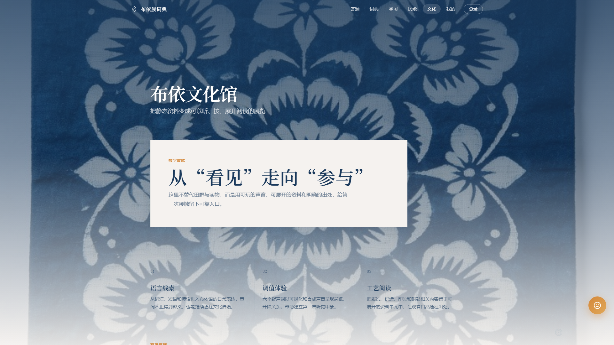
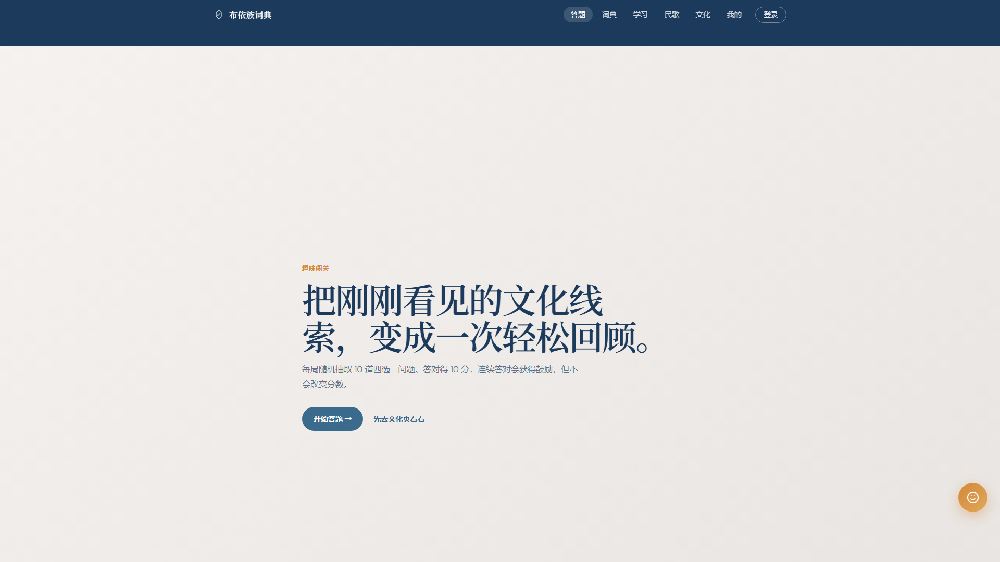

# 数字文化馆演示记录

日期：2026-07-14（Windows）  
项目：布依词典前端三期优化

## 音频发布映射

线上曲目优先使用接口给出的 `audioUrl`；加载或频谱跨域失败时，播放器会切换到下列随前端发布的 `public/audio` 文件。三条没有媒体地址的原始记录不会进入歌单。

| 后端音频文件名 | 前端回退文件 | 展示曲目 |
| --- | --- | --- |
| `buyi-lulonghu.mp3` | `/audio/buyi-lulonghu.mp3` | 布依 · 陆龙华 |
| `buyi-wujian.mp3` | `/audio/buyi-wujian.mp3` | 布依 · 吴建 |
| `tuomie-buyi-lujiaxing.mp3` | `/audio/tuomie-buyi-lujiaxing.mp3` | 托么（来咯魂）· 卢家兴 |
| `xiaoamei-buyi-lujiaxing.mp3` | `/audio/xiaoamei-buyi-lujiaxing.mp3` | 小阿妹（妹侬聂）· 卢家兴 |
| `maliaolei-wangxingfei-wangyufan.mp3` | `/audio/maliaolei-wangxingfei-wangyufan.mp3` | 麻辽勒 · 王兴飞、王玉芳 |
| `maliaolei-wangxingfei-others.mp3` | `/audio/maliaolei-wangxingfei-others.mp3` | 麻辽勒（四人合唱版）· 王兴飞等 |

## 文化资料出处

- [中国非遗网：布依族服饰](https://www.ihchina.cn/project_details/15328.html)
- [中国非遗网：布依斗纹布——绣艺里的传承创新](https://www.ihchina.cn/news_1_details/25730.html)
- [中国非遗网：铜鼓十二调](https://www.ihchina.cn/project_details/12584/)

页面只使用项目既有图片；纹样详情中的工艺、历史和象征性说明均链接至上述公开条目。

## 自动回归

```powershell
npm test
npm run build
```

结果：8 项 Node 测试通过，生产构建通过。测试覆盖媒体事件状态同步、远程音频回退、六首离线歌单、声调键盘映射、题目抽取与计分。

## 1920 × 1080 界面证据

使用 Windows Edge 无头模式渲染，页面入口分别为 `/`、`/culture` 与 `/quiz`。






## 现场演示清单

- 首页：首次会话序章可点击或按 Enter/Escape 跳过；减弱动态偏好直接进入内容。
- 民歌：检查真实时长、播放/暂停、拖动、自然结束；断网后确认本地回退提示与六首静态歌单。
- 频谱：播放时频带持续变化，暂停或离开歌曲页后停止绘制。
- 文化页：聚焦声调钢琴后按 `1`–`6`；打开纹样详情后以 Escape 关闭并确认焦点回到触发卡片。
- 答题：确认每局十题、四选项乱序、每题即时解释、错题复盘与“再来一局”。

注：仓库保留的是静态界面证据和可复现的演示清单；交互录屏需在目标演示机的 Chrome 或 Edge 中按上述清单采集。
